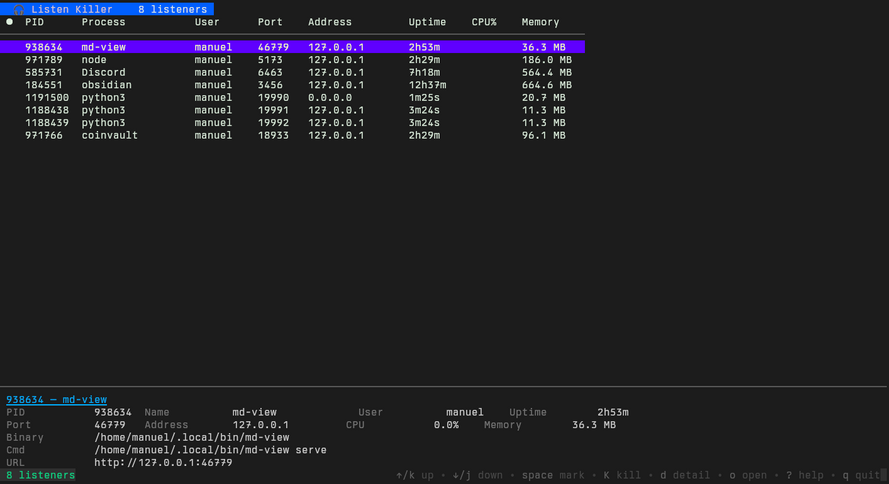
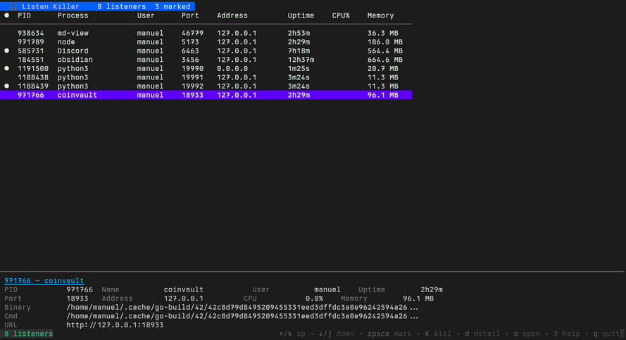
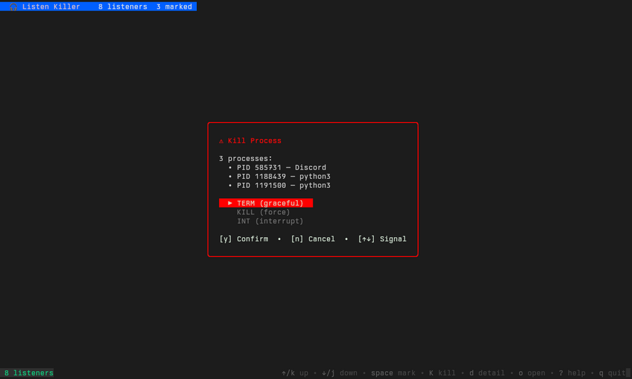
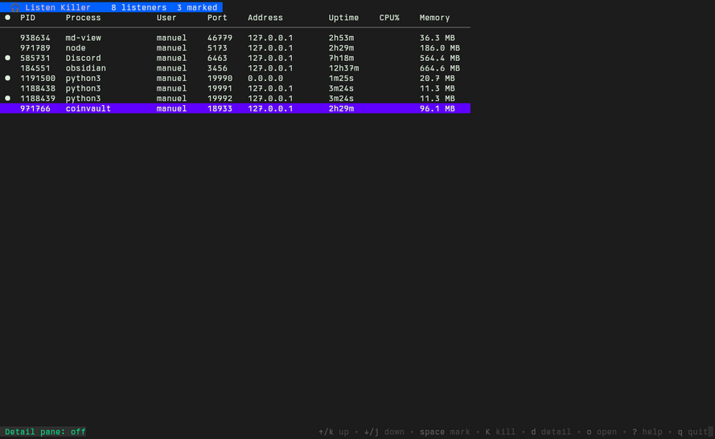

# 🎧 Listen Killer

A terminal UI for discovering, inspecting, and killing TCP listeners on your machine.

Every dev machine accumulates stale daemons — dev servers, database proxies, API mocks, editor plugins — all quietly holding ports open. Listen Killer shows them all in one place and lets you kill them instantly.

## Screenshots

### Main View — Table + Detail Pane



The default view shows a scrollable table of all TCP listeners with a detail pane below. Navigate with `j`/`k`; the detail pane updates as you move.

### Multi-Mark — Selecting Processes



Press `space` to mark rows (shown with `●`). Marked processes can be bulk-killed together. The title bar shows the count: `7 listeners  3 marked`.

### Kill Confirmation — Bulk Kill



Press `K` to open the kill dialog. If processes are marked, all of them are targeted. Choose a signal (TERM/KILL/INT) with `↑↓`, confirm with `y`, cancel with `n`.

### Table Only — Detail Pane Toggled Off



Press `d` to toggle the detail pane. Without it, the table gets the full terminal height.

## Installation

```bash
go install github.com/wesen/listen-killer/cmd/listen-killer@latest
```

Or build from source:

```bash
git clone https://github.com/wesen/listen-killer.git
cd listen-killer
go build -o ~/bin/listen-killer ./cmd/listen-killer/
```

## Usage

### Interactive TUI (default)

```bash
listen-killer          # launches the TUI dashboard
```

### CLI / Scripting Mode

```bash
listen-killer list --no-tui                     # table output
listen-killer list --no-tui --output json       # JSON output
listen-killer list --no-tui --output yaml       # YAML output
listen-killer list --no-tui --output csv        # CSV output
listen-killer list --no-tui --fields pid,name,port,uptime  # select columns
```

## Key Bindings

| Key | Action |
|-----|--------|
| `j` / `↓` | Move down |
| `k` / `↑` | Move up |
| `space` | Mark/unmark current row |
| `M` | Clear all marks |
| `K` | Kill selected (or all marked) |
| `o` | Open `http://host:port` in browser |
| `d` | Toggle detail pane |
| `r` | Refresh listener list |
| `a` | Toggle auto-refresh (3s) |
| `?` | Toggle full help |
| `q` / `ctrl+c` | Quit |

### Kill Dialog Keys

| Key | Action |
|-----|--------|
| `↑` / `↓` | Change signal (TERM → KILL → INT) |
| `y` / `enter` | Confirm kill |
| `n` / `esc` | Cancel |

## Features

### Multi-Mark

Press `space` on any row to mark it (shown with `●`). The cursor auto-advances down for rapid marking. Press `K` when marks exist to kill all marked processes at once. Clear marks with `M`.

### Detail Pane

A compact detail view below the table shows all metadata for the selected process: PID, name, full command line, binary path, user, port, bind address, uptime, CPU%, memory, and the computed browser URL. It auto-updates as you navigate.

### Open in Browser

Press `o` to open the selected listener in your default browser (`xdg-open` on Linux, `open` on macOS). Bind addresses like `0.0.0.0`, `*`, or `::` are normalized to `127.0.0.1`.

### CLI Output

The same data is available as structured output via the Glazed command framework:

```bash
# Pretty table
listen-killer list --no-tui

# JSON for scripting
listen-killer list --no-tui --output json | jq '.[] | select(.port > 10000)'

# CSV for spreadsheets
listen-killer list --no-tui --output csv

# Custom columns
listen-killer list --no-tui --fields pid,name,port,uptime,rss_human
```

## Architecture

```
┌──────────────────────────────────────────────┐
│  Title bar: 🎧 Listen Killer  N listeners    │
├──────────────────────────────────────────────┤
│  Table (scrollable)                          │
│  ●  PID    Process    Port   Uptime  Memory  │
│    585731  Discord    6463   7h19m  565 MB   │
│  ● 184551  obsidian   3456   12h37m 665 MB   │
│                                              │
├──────────────────────────────────────────────┤
│  Detail pane                                 │
│  184551 — obsidian                           │
│  PID  184551  Name   obsidian  User  manuel  │
│  Port  3456   Addr   127.0.0.1  Up   12h37m  │
│  Binary  /app/obsidian                       │
│  URL  http://127.0.0.1:3456  ● MARKED        │
├──────────────────────────────────────────────┤
│  Footer: status + key help                   │
└──────────────────────────────────────────────┘
```

### Data Flow

1. **Scanner** (`pkg/listener/scanner.go`): Uses `gopsutil/net` to find all TCP LISTEN sockets, then enriches each with process details from `gopsutil/process`.
2. **TUI** (`pkg/tui/`): Bubbletea model with three modes — table navigation, kill confirmation dialog, and detail pane. The table is the `bubbles/table` widget from Charmbracelet.
3. **CLI** (`cmd/listen-killer/`): Glazed command framework wraps the scanner for structured CLI output (JSON/YAML/CSV/table).

### Tech Stack

| Component | Library |
|-----------|---------|
| TUI framework | [Bubbletea](https://github.com/charmbracelet/bubbletea) |
| Table widget | [bubbles/table](https://github.com/charmbracelet/bubbles) |
| Styling | [Lipgloss](https://github.com/charmbracelet/lipgloss) |
| CLI framework | [Glazed](https://github.com/go-go-golems/glazed) |
| System info | [gopsutil](https://github.com/shirou/gopsutil) |

## License

MIT
